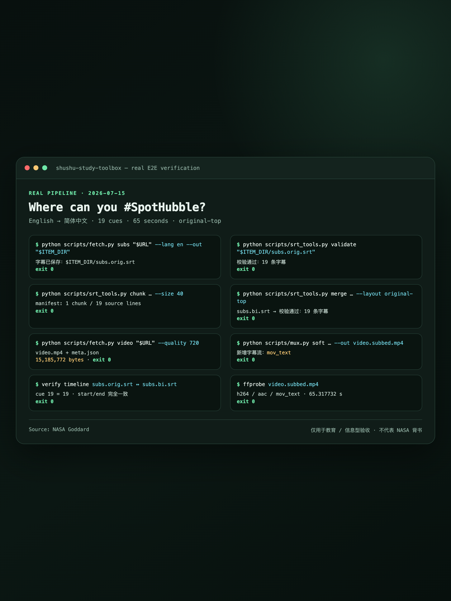
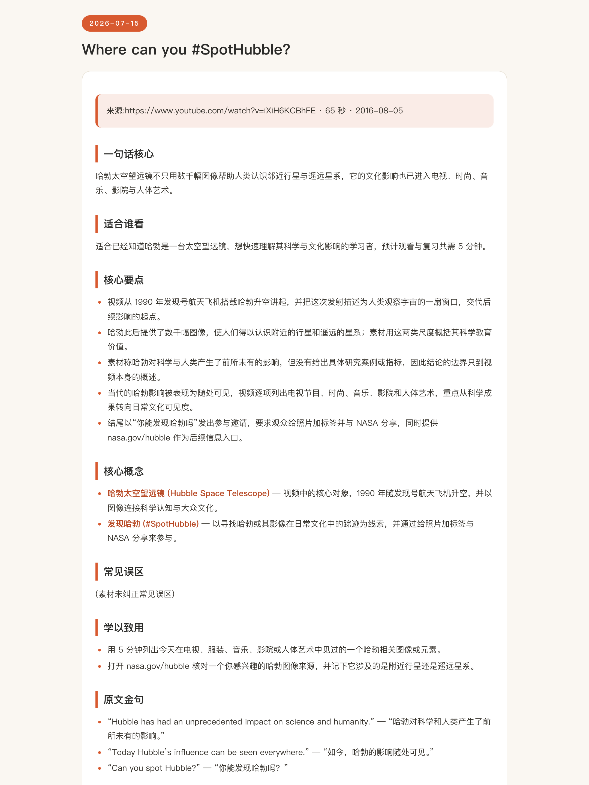

# Shushu Study Toolbox / 树树工具箱

**English quick start:** Shushu Study Toolbox is an agent skill that turns public videos, subtitles, webpages, and PDFs into bilingual study materials without requiring an external API key. Python 3.13 is recommended. Replace `<your-github-username>`, then run:

```bash
git clone https://github.com/<your-github-username>/shushu-study-toolbox.git
cd shushu-study-toolbox
python3.13 -m venv .venv
source .venv/bin/activate
python -m pip install -r requirements.txt
cp config.example.json config.json
python scripts/doctor.py
```

## 是什么

树树工具箱是一套给 Claude Code、Codex 等 agent 使用的本地 skill，把公开视频、字幕、网页和 PDF 整理成可复习的双语学习材料，机械处理留给脚本，翻译与总结留给 agent，全程不需要填写外部 API key。

| 工具 | 能做什么 | 详细手册 |
| --- | --- | --- |
| 树树工具箱 - 下载素材 | 用 yt-dlp 下载完整视频或仅音频 | [tools/download.md](tools/download.md) |
| 树树工具箱 - 获取字幕 | 优先获取来源字幕，经确认后才用 faster-whisper 本地转写 | [tools/subtitle.md](tools/subtitle.md) |
| 树树工具箱 - 翻译字幕 | 把 SRT 分块、交给 agent 翻译，再合并为双语字幕 | [tools/translate.md](tools/translate.md) |
| 树树工具箱 - 视频嵌字幕 | 用 ffmpeg 软封装可开关字幕，或硬烧录永久字幕 | [tools/embed.md](tools/embed.md) |
| 树树工具箱 - 生成学习笔记 | 根据已校验素材生成结构化双语 Markdown 笔记 | [tools/notes.md](tools/notes.md) |
| 树树工具箱 - 精读网页与 PDF | 在全文翻译和双语摘要之间任选一种 | [tools/digest.md](tools/digest.md) |

下面的演示素材来自 **NASA Goddard / NASA's Goddard Space Flight Center**，仅用于展示个人学习流水线；NASA 未对本项目提供或暗示任何背书。



*终端流水线示例。素材署名：NASA Goddard；不代表 NASA 背书。*


*双语字幕示例。视频素材：NASA's Goddard Space Flight Center；不代表 NASA 背书。*



*学习笔记示例。来源素材署名：NASA Goddard；不代表 NASA 背书。*

## 三步安装

推荐使用 **Python 3.13**。项目要求 Python 3.10 或更高版本，但 Python 3.14 目前无法安装 `faster-whisper`；它仍可使用下载、来源字幕、翻译、嵌字幕、笔记和资料精读功能。

### 1. Clone 仓库

先把 `<你的 GitHub 用户名>` 替换成实际用户名：

```bash
git clone https://github.com/<你的 GitHub 用户名>/shushu-study-toolbox.git
cd shushu-study-toolbox
```

### 2. 创建环境、安装依赖并运行 doctor

macOS / Linux：

```bash
python3.13 -m venv .venv
source .venv/bin/activate
python -m pip install -r requirements.txt
python scripts/doctor.py
```

Windows CMD：

```bat
py -3.13 -m venv .venv
.venv\Scripts\activate
python -m pip install -r requirements.txt
python scripts\doctor.py
```

doctor 全部显示 `✅` 且退出码为 0，说明 Python、yt-dlp、ffmpeg、faster-whisper 和输出目录均已就绪。只有 `faster-whisper` 未通过时，除本地转写外的能力仍可照常使用；本地转写需切换到 Python 3.13。

### 3. 复制配置并接入 agent

先复制配置模板，再按需要编辑 `config.json` 中的输出目录、母语、源语言、转写模型、视频清晰度和字幕顺序。

macOS / Linux（全局接入 Claude Code）：

```bash
cp config.example.json config.json
mkdir -p "$HOME/.claude/skills"
ln -s "$(pwd -P)" "$HOME/.claude/skills/shushu-study-toolbox"
```

Windows CMD（开启“开发人员模式”，或以管理员身份运行）：

```bat
copy config.example.json config.json
if not exist "%USERPROFILE%\.claude\skills" mkdir "%USERPROFILE%\.claude\skills"
mklink /D "%USERPROFILE%\.claude\skills\shushu-study-toolbox" "%CD%"
```

若目标链接已存在且指向本仓库，无需重复创建。配置完成后再运行一次 `python scripts/doctor.py`。

## 各类 agent 怎么接入

先取得 `SKILL.md` 的绝对路径：在仓库根目录运行 `pwd -P`（macOS / Linux）或 `cd`（Windows CMD），再在结果末尾加 `/SKILL.md` 或 `\SKILL.md`。

| agent | 接入方式 |
| --- | --- |
| Claude Code | 上面的 `~/.claude/skills/` 软链接可供全局发现；也可在项目 `CLAUDE.md` 写入“完整阅读并遵循 `/仓库绝对路径/shushu-study-toolbox/SKILL.md`”。 |
| Codex | 在目标项目的 `AGENTS.md` 写入“完整阅读并遵循 `/仓库绝对路径/shushu-study-toolbox/SKILL.md`”。 |
| 其它 agent | 在它的系统指令、项目指令或自定义 skill 设置中附上 `SKILL.md` 的绝对路径，并要求先完整阅读该文件，再按其中路由读取对应工具手册。 |

路径必须是本机真实的绝对路径，不能原样复制表格里的占位文字。新开一个 agent 会话后，可以说“帮我把这个视频做成双语笔记”验证是否命中。

## 六个工具，各用一次

这些句子可直接对已接入的 agent 说；链接和路径请换成你有权处理的真实素材。

| 工具 | 一条真实用法 |
| --- | --- |
| 树树工具箱 - 下载素材 | “把这个公开视频下载到我的学习目录，最高 1080p，只供个人学习：`https://example.com/video`。” |
| 树树工具箱 - 获取字幕 | “先获取这条视频的英文来源字幕；如果没有，估算本地转写时间并问我是否继续。” |
| 树树工具箱 - 翻译字幕 | “把本次 `ITEM_DIR` 中的 `subs.orig.srt` 翻成配置布局的双语字幕，支持中断续跑。” |
| 树树工具箱 - 视频嵌字幕 | “把 `video.mp4` 和 `subs.bi.srt` 软封装为可开关字幕的视频，不要覆盖源文件。” |
| 树树工具箱 - 生成学习笔记 | “根据这个目录中已校验的双语字幕生成一篇中文为主、关键术语保留英文的学习笔记。” |
| 树树工具箱 - 精读网页与 PDF | “精读这份 PDF；我要双语摘要，不要全文翻译，并给可核对的引文页码。” |

也可以逐条运行机械脚本；真实参数以各工具手册和
`python scripts/<脚本>.py --help` 为准。下面是逐条模板，不是可整段执行的 Shell 脚本。
先单独运行 `prepare`，读取它在 stdout 返回的 JSON：

```bash
python scripts/common.py prepare --title "<真实标题>"
```

然后把下列尖括号占位符逐个替换为这份 JSON 的真实值，再逐条执行；
Bash/zsh 与 PowerShell 都采用这种替换方式，不要把占位符当成变量：

```text
python scripts/fetch.py video "<URL>" --quality "<video_quality>" --out "<item_dir>"
python scripts/fetch.py subs "<URL>" --lang "<source_lang>" --out "<item_dir>"
python scripts/srt_tools.py validate "<item_dir>/subs.orig.srt"
python scripts/mux.py soft "<item_dir>/video.mp4" "<item_dir>/subs.bi.srt" --out "<item_dir>/video.soft.mp4"
```

同一流水线只运行一次 `prepare`，后续步骤复用同一个 `ITEM_DIR`。

## FAQ

### Python 3.14 装不上 faster-whisper，怎么办？

`requirements.txt` 会在 Python 3.14 跳过 `faster-whisper`，所以安装本身可以完成，但 doctor 会把本地转写标为不可用并返回 exit 1。推荐安装 Python 3.13，重新创建 `.venv` 后安装依赖。若暂时不转写，下载、获取来源字幕、字幕翻译、视频嵌字幕、笔记和资料精读都仍可使用。

### 来源没有目标语言字幕（人工或自动）时，怎么办？

`fetch.py subs` 会先查找目标语言的人工字幕，再回退到自动字幕；只有两者都没有时才返回 exit 3。agent 应先根据可靠视频时长估算本地转写耗时，询问“无目标语言来源字幕（人工或自动），转写约需 X 分钟，继续吗？”，得到明确同意后才下载音频并用本地 `faster-whisper` 转写；不会静默降级，也不会把素材交给未获许可的外部服务。

### Windows 终端或字幕乱码，怎么排查？

确保仓库、`config.json` 和 SRT 都以 UTF-8 保存；Windows CMD 可先运行：

```bat
chcp 65001
set PYTHONUTF8=1
python scripts\doctor.py
```

仍有问题时检查终端字体是否包含中文字形，并保留路径两侧的引号。硬字幕显示方框时，可按嵌字幕手册用已安装的中文字体重试，例如 `--font "Microsoft YaHei"`。

## 合规声明

**下载与转写仅供个人学习，遵守各平台服务条款，不得用于传播下载内容。** 只处理你有权访问和使用的素材，不绕过登录、付费墙、会员限制、地区限制或其他访问控制；转载、公开展示或再发布前，请自行确认版权与授权。

## License

本项目采用 [MIT License](LICENSE)。
