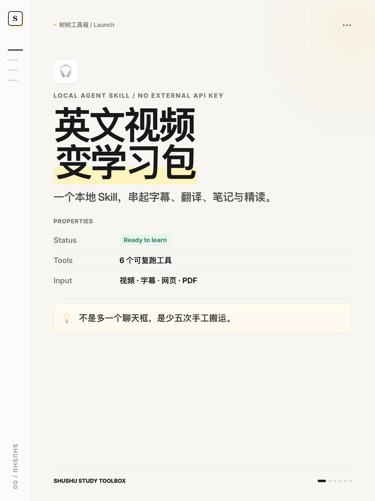
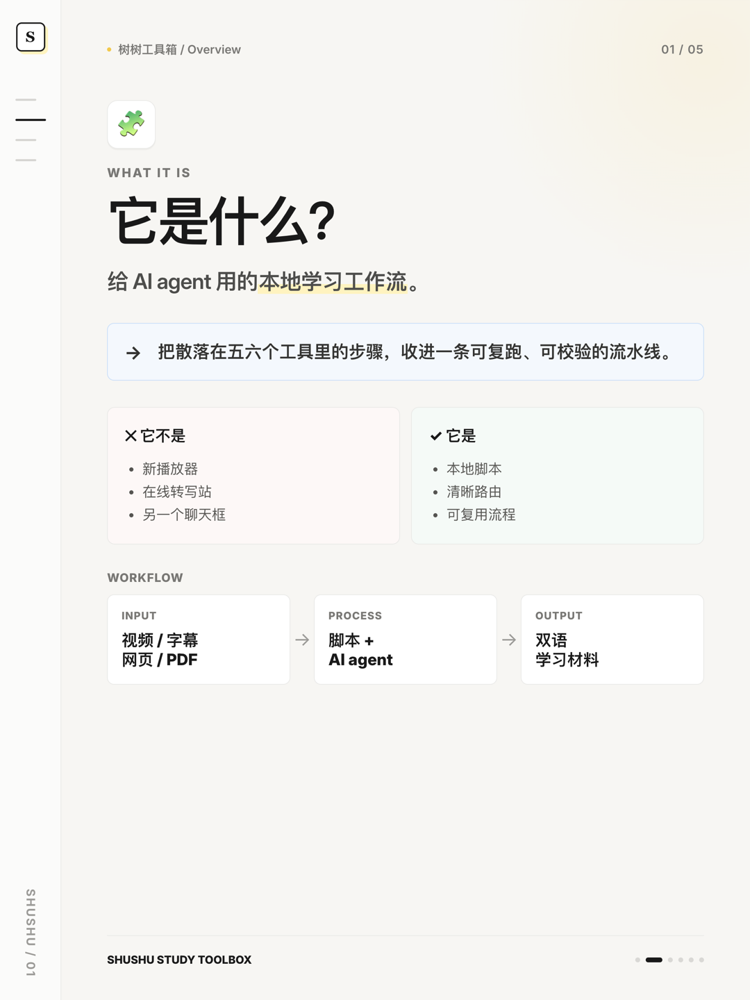
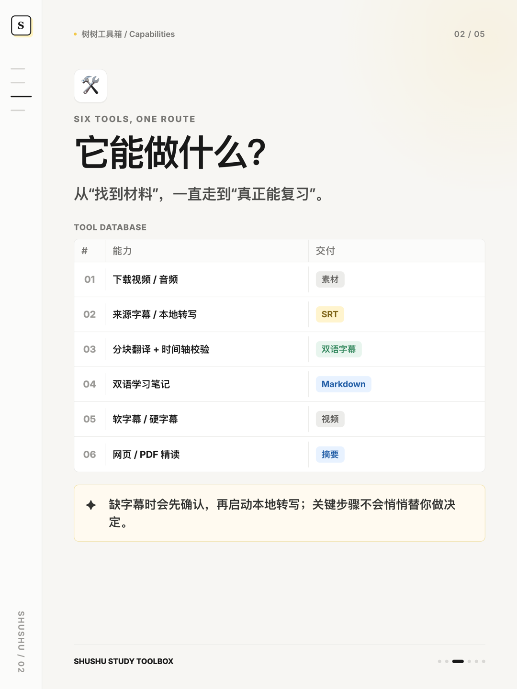
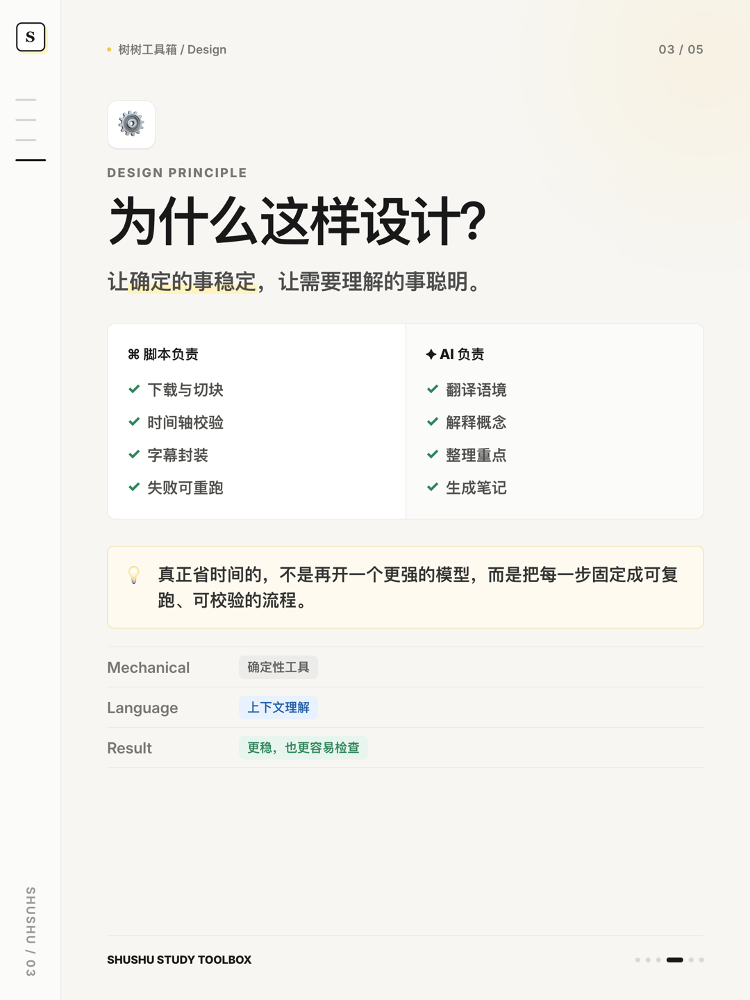
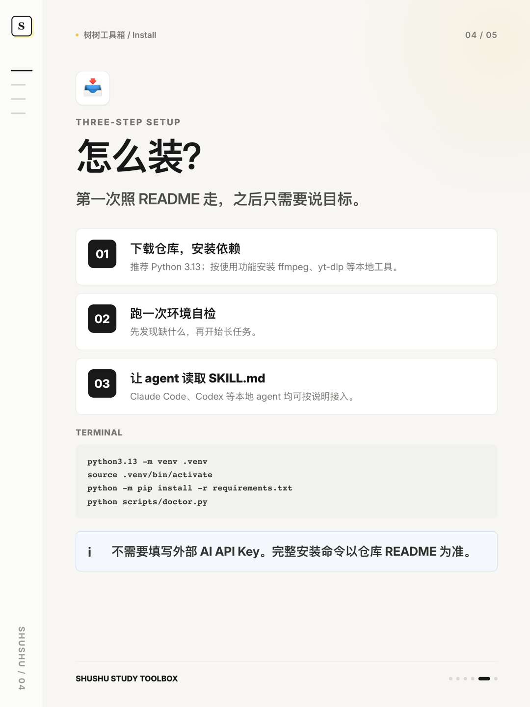

# 小红书图文成稿｜树树工具箱

## 发布前置检查（不复制到小红书）

- [ ] 已按 [`docs/publish-to-github.md`](../docs/publish-to-github.md) 发布公开仓库。
- [ ] GitHub Actions 的 6 个矩阵任务全部通过。
- [ ] 已在无痕窗口打开 `JimMyood/shushu-study-toolbox` 仓库。
- [ ] 6 张配图已按顺序上传，文字没有被小红书裁切。
- [ ] NASA 演示数据仍与仓库实测记录一致。

在上面 5 项全部完成前，不要发布“已经开源”或“链接见首评”。

## 封面大字

**英文视频变学习包**

副标题：`一个本地 Skill · 6 个工具 · 0 个额外 API Key`

## 标题

**把英文视频学习做成了1个Skill**

备选：

1. 一个Skill串起6步英文学习
2. 不装新App，也能做双语学习包

## 正文（GitHub 发布后直接复制）

真正拖慢英文视频学习的，往往不是听不懂。

而是下载、找字幕、对时间轴、翻译、做笔记，散在五六个工具里。链接收藏一堆，真正学完的没几条。

所以这次把它做成了一个本地 Skill：**树树工具箱**。

它不是播放器，也不是又一个聊天框。

它是一套给 Claude Code、Codex 这类 AI agent 使用的学习工作流：把视频、字幕、网页或 PDF，整理成可复习的双语材料。

它能做 6 件事：

① 下载视频或音频
② 优先获取来源字幕
③ 分块翻译并校验时间轴
④ 生成双语学习笔记
⑤ 软封装或硬烧录字幕
⑥ 精读网页与 PDF

我的判断是：**真正省时间的，不是再开一个更强的模型，而是把每一步固定成可复跑、可校验的流程。**

下载、切块、校验、封装交给脚本；翻译、总结和解释交给 AI。机械活和语言活分开，流程反而更稳，而且不需要填写外部 API Key。

怎么用？

1. 下载仓库并安装依赖
2. 把 `SKILL.md` 接入你的 agent
3. 直接说：“帮我把这个英文视频做成双语学习笔记”

拿 NASA Goddard 的 65.32 秒公开视频做过完整实测：得到 19 条双语字幕，并完成软字幕、硬字幕和本地转写链路。演示只用于流程验证，不代表 NASA 背书。

仓库同时配置了全量回归测试，以及 Ubuntu、macOS、Windows × Python 3.11、3.13 的持续集成检查。

项目已经公开到 GitHub，仓库链接放在首评。仅处理你有权使用的公开素材，下载与转写只供个人学习。

## 话题标签

#AI工具 #ClaudeCode #Codex #英语学习 #开源项目 #效率工具 #双语字幕

## 首评（发布时替换用户名）

GitHub：`https://github.com/JimMyood/shushu-study-toolbox`

完整安装步骤在 README。你最想先跑双语字幕，还是学习笔记？

## 配图顺序

1. 
2. 
3. 
4. 
5. 
6. 

## 图片检查口径

- 画布统一为 3:4，纯文字为主，使用 Notion 式页面、属性表、callout、数据库和代码块。
- 首图负责停留；内页依次回答“是什么、能做什么、为什么、怎么装、怎么说”。
- 不在图片里写尚未确认的 GitHub 用户名或仓库 URL，避免发布前返工。
- NASA 数据仅出现在最后一页，并保留“不代表 NASA 背书”的边界说明。
